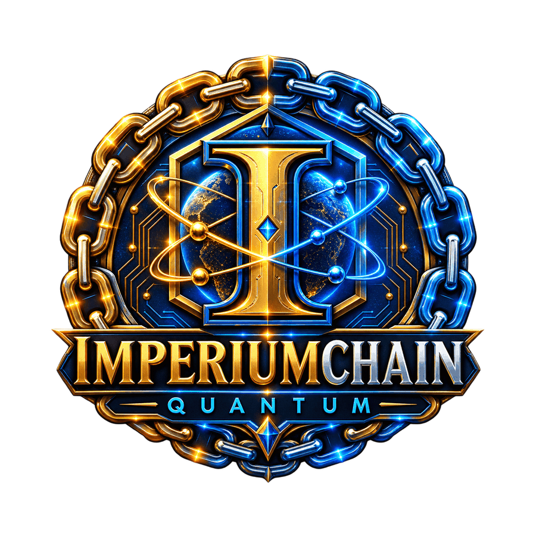

<p align="center">
  
</p>

<h1 align="center">Quantum Imperium — The Ethereum Backup Plan</h1>

<p align="center">
  <strong>A quantum-safe, modular Layer-1 blockchain designed to complement Ethereum.</strong>
</p>

<p align="center">
  
  
  
</p>

> *"Ethereum is the present. We are the future. But the future is already here, and it can coexist with the present."*

---

## 🚀 Quick Start

```bash
git clone https://github.com/Dev-Ceo26/quantum-imperium.git
cd quantum-imperium
pip install -r requirements.txt
python3 api_server.py

📚 Documentation
White Paper
Contributing Guide
🧩 Architecture
Component	Technology	Status
PQC	Kyber / Dilithium	✅ Implemented
Consensus	QPoS	✅ Implemented
VM	QVM	✅ Implemented
Storage	IPFS + Tor	✅ Implemented
API	Flask REST	✅ Implemented
Bridge	Multi-sig Guardian	🚧 In development
🛣️ Roadmap
Phase	Description	Target
Phase 0	Working Prototype	✅ Q1 2026
Phase 1	Public Testnet	🔄 Q2 2026
Phase 2	Ethereum Bridge	📅 Q3 2026
Phase 3	Mainnet + DAO	📅 Q4 2026
📄 License

MIT License

🔗 Links
Website: imperiumchain.com
Imperium Scan: imperiumscan.com
GitHub: Quantum Imperium Repository
Twitter: Coming soon
Discord: (https://discord.gg/J2W8Dk56m)
---

<p align="center">
  <strong>Quantum Imperium Core Team</strong><br>
  <sub>April 2026</sub>
</p>

